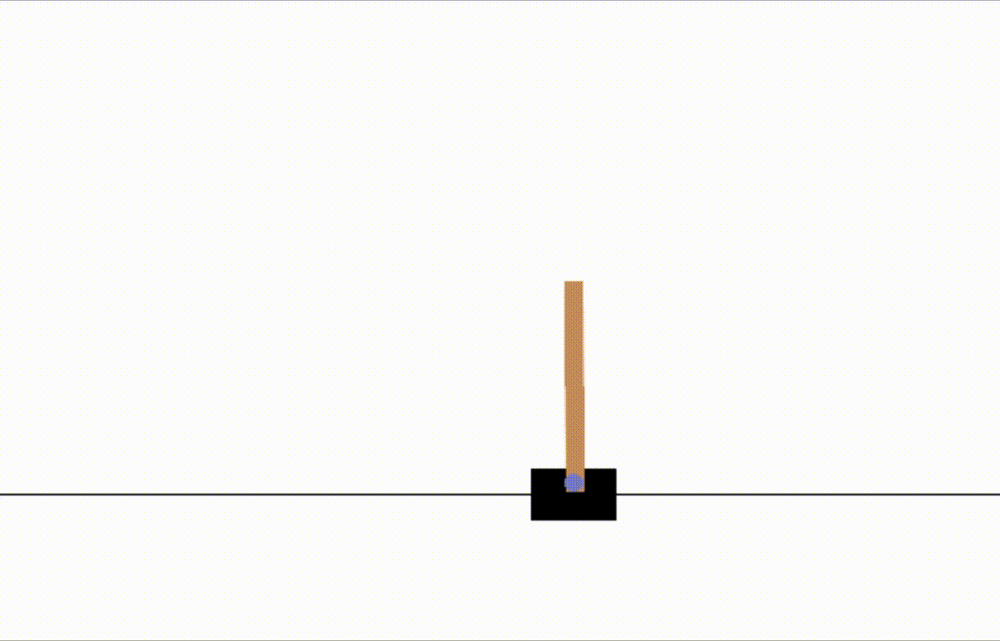

# rl

## Implementations

* REINFORCE
* A2C
* PPO

Notes:

* A2C suffers from instability issues. A few helpful tricks:
  * advantage normalization
  * use a learning schedule
  * gradient norm clipping
  * carefully tune learning rate and other parameters
* PPO makes training much more stable. See A2C and PPO (both using GAE with same lambda to calculate advantages) comparison on CartPole-V1 (experimented using [8181d9f](https://github.com/k-duan/rl/commit/8181d9f9b30e35811a9f039947fc08cf6cb50ad8)
):

